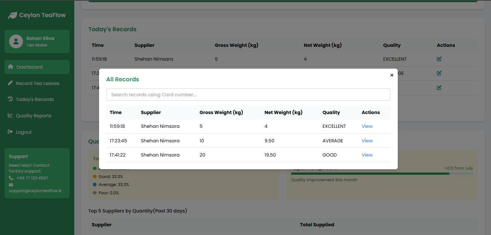

# 🌿 Ceylon TeaFlow – Tea Factory Management System

## 📖 Project Description
**Ceylon TeaFlow** is a **Tea Factory Management System** designed to simplify and digitalize the operations of a tea production factory.  
This system provides a **centralized platform** to manage tea leaf suppliers, non-supplier customers, tea stock, employee details, and order processing.

The application supports **two types of customers**:
1. **Tea Leaf Suppliers** – Can register with a tea card number, apply for tea leaf packets, and view monthly supply history.
2. **Non-Supplier Customers** – Can create normal customer accounts, order tea leaf packets online, and track order status.

The platform allows **factory managers** to handle tasks such as registering suppliers, recording raw and dry tea leaf stock, managing tea varieties and prices, processing customer orders, and monitoring daily operations.

---

## ✨ Key Features
### 👥 User Management
- Customers can create accounts as:
  - **Tea Leaf Supplier** (requires a tea card number).
  - **Normal Customer** (non-supplier).
- Factory **CEO** approves and registers suppliers before they can supply tea leaves.

### 🍃 Tea Leaf Operations
- Tea maker measures and records raw tea leaves (defect-adjusted) in the system.
- Stock Manager updates daily dry tea leaf stock.
- CEO registers tea varieties and sets pricing.

### 📦 Order Management
- Tea leaf suppliers can request tea leaf packets.
- Non-supplier customers can place online tea packet orders with courier delivery.
- Customers can check the status of their previously placed orders.

### 📊 Monitoring & Reports
- CEO monitors all operations from a single dashboard.
- Suppliers can view the amount of tea leaves they have provided monthly (calendar view).

---

## 🖼️ Screenshots
- **Home Page**  
  
  
  
- **Admin Dashboard**  
  
  
- **Supplier Dashboard**  
  
- **Stock Dashboard**  
  
- **Tea Maker**  
  

---

## 🛠️ Technologies Used
| Layer          | Technology |
|----------------|------------|
| **Frontend**   | HTML5, CSS3, JavaScript (ES6), jQuery, Tailwind CSS, SweetAlert2 |
| **Backend**    | Spring Boot, Spring Security (JWT), Hibernate ORM, JPA |
| **Database**   | MySQL |
| **Design Tools** | Figma (UI/UX Prototyping), Draw.io (ER Diagrams) |
| **Build & Tools** | Maven, Postman (API Testing), Git/GitHub |

---

## ⚙️ Setup Instructions

### 1️⃣ Prerequisites
Ensure the following are installed:
- [Java JDK 17+](https://adoptium.net/)
- [Node.js & npm](https://nodejs.org/)
- [MySQL Server](https://dev.mysql.com/downloads/mysql/)
- [Maven](https://maven.apache.org/install.html)

---

### 2️⃣ Backend Setup (Spring Boot)
```bash
# Clone the repository
git clone https://github.com/<your-username>/Ceylon-TeaFlow.git
cd Ceylon-TeaFlow/backend

# Update application.properties with your MySQL credentials
spring.datasource.url=jdbc:mysql://localhost:3306/ceylon_teaflow
spring.datasource.username=<your_mysql_username>
spring.datasource.password=<your_mysql_password>

# Build and run the backend
mvn clean install
mvn spring-boot:run
